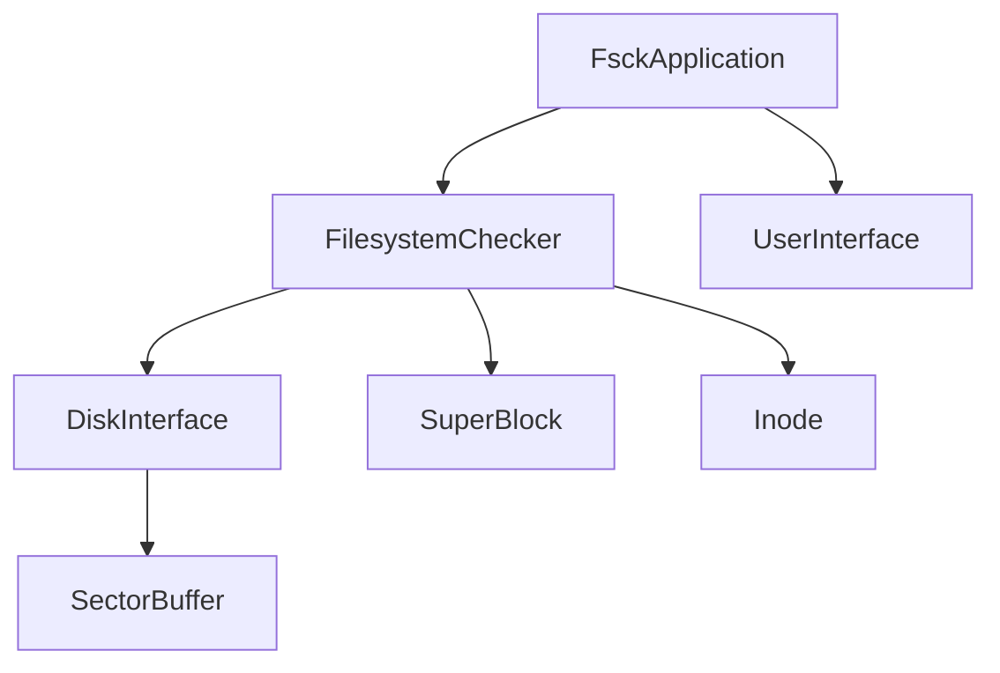

# XINIM Operating System

Modern C++23 reimplementation of the classic MINIX 1 operating system. The
project combines kernel, memory management, userland utilities, and disk tools
into a cohesive educational system.


Modern C++23 implementation of the entire MINIX 1 codebase with enhanced type
safety, improved portability, and comprehensive error handling. The repository
includes the kernel, memory manager, file system, standard commands, system
libraries, and auxiliary build tools.

## Overview

This project provides a complete reimplementation of MINIX 1 written in C++23.
The codebase emphasizes:

- **Type Safety**: Strong typing and RAII patterns throughout
- **Performance**: Optimized algorithms with caching and batched operations
- **Portability**: Cross-platform support for Unix-like systems and Windows
- **Maintainability**: Clean architecture with comprehensive documentation
- **Reliability**: Extensive error handling and validation

## Components

- **kernel**: Low-level hardware management, interrupts, and process scheduling
- **mm**: Memory management and paging facilities
- **fs**: MINIX file system implementation and disk drivers
- **lib**: Standard C library and runtime support
- **commands**: Core userland utilities
- **tools**: Boot image builder and filesystem tools

## Disk System

### Filesystem Checker (`fsck`)

- **Complete Validation**: Multi-phase filesystem integrity checking
- **Smart Repair**: Interactive and automatic repair capabilities
- **Performance Monitoring**: I/O statistics and performance metrics
- **Flexible Operation**: Read-only checking, interactive repair, or automatic fixing
- **Comprehensive Reporting**: Detailed error reporting with path context

### Key Improvements Over Original

- **Modern C++23**: Leverages latest language features for safety and performance
- **Memory Safe**: RAII resource management eliminates memory leaks
- **Cross-Platform**: Works on Linux, macOS, BSD, and Windows
- **Enhanced Caching**: Smart sector caching with write-through for performance
- **Better Error Handling**: Structured exceptions with full context information
- **Comprehensive Validation**: More thorough filesystem structure checking

## Building

Each major component can be built individually using the Makefiles located in
`kernel/`, `mm/`, `fs/`, `commands/`, and `lib/`. The top-level CMake
configuration builds the entire system in one step and is recommended for new
users.

### Prerequisites

- **Compiler**: GCC 13+ or Clang 16+ with C++23 support (MSVC 19.36+ supported)
- **Build System**: Make (GNU Make recommended)
- **Optional**: Doxygen for documentation, Valgrind for debugging

### Quick Start

```bash
# Clone the repository
git clone <repository-url>
cd XINIM

# Build debug version (default)
make

# Build optimized release version
make BUILD_MODE=release

# Install system-wide
sudo make install
```

### Build Modes

| Mode | Description | Flags |
|------|-------------|-------|
| `debug` | Development build with sanitizers | `-g3 -O0 -fsanitize=address,undefined` |
| `release` | Optimized production build | `-O3 -DNDEBUG -flto -march=native` |
| `profile` | Profiling build | `-O2 -g -pg` |

### Make vs CMake

The repository includes both a traditional `Makefile` and a full
`CMakeLists.txt`. Each defines a `fsck` target, so use only **one** build system
at a time and run `make clean` when switching to avoid mixing artifacts.

Use **Make** for quick manual compilation of the filesystem tools or when you
only need to build a single component.

Use **CMake** to build the entire system, enable optional drivers, or perform
out-of-tree and cross-compilation builds.

The CMake configuration defaults to the C++23 standard. Ensure GCC 13+ or Clang 16+ (or MSVC 19.36+) is available for successful compilation. A typical CMake workflow is:

```bash
cmake -B build
cmake --build build
```


### Build Targets

```bash
make all          # Build all targets
make fsck         # Build filesystem checker
make clean        # Remove build artifacts
make distclean    # Remove all generated files
make check        # Run basic functionality tests
make lint         # Run static analysis
make format       # Format source code
make docs         # Generate documentation
make valgrind     # Run memory checking
```

### Cross Compilation

Cross compilation is currently supported only for bare x86-64 targets.

Build with CMake:

```bash
cmake -B build -DCROSS_COMPILE_X86_64=ON -DCROSS_PREFIX=x86_64-elf-
cmake --build build
```

The equivalent Make invocation is:

```bash
make CROSS_PREFIX=x86_64-elf-
```

The `CROSS_PREFIX` value selects the appropriate cross toolchain (e.g.
`x86_64-elf-gcc`).

To target additional architectures add a new `CROSS_COMPILE_<ARCH>` option to
`CMakeLists.txt`, update the root `Makefile` with matching variables, and set
`CMAKE_SYSTEM_NAME` and `CMAKE_SYSTEM_PROCESSOR` for the target.

## Usage

### Filesystem Checker

```bash
# Check filesystem (read-only)
./bin/fsck /dev/sdb1

# Interactive repair mode
./bin/fsck -i /dev/sdb1

# Automatic repair mode
./bin/fsck -a /dev/sdb1

# List filesystem contents
./bin/fsck -l /dev/sdb1

# Show help
./bin/fsck --help
```

### Command Line Options

| Option | Description |
|--------|-------------|
| `-a` | Automatic repair mode (answer 'yes' to all questions) |
| `-i` | Interactive repair mode (ask before each repair) |
| `-l` | List filesystem contents only |
| `-v` | Verbose output |
| `-h, --help` | Show help message |

## Architecture

### Core Components



```text
┌─────────────────┐    ┌─────────────────┐    ┌─────────────────┐
│   FsckApplication │────│ FilesystemChecker │────│   DiskInterface  │
│                 │    │                 │    │                 │
│ • Argument      │    │ • Phase-based   │    │ • Cross-platform│
│   parsing       │    │   checking      │    │ • Caching       │
│ • User interface│    │ • Repair logic  │    │ • Statistics    │
│ • Error handling│    │ • Validation    │    │ • Error handling│
└─────────────────┘    └─────────────────┘    └─────────────────┘
          │                       │                       │
          ▼                       ▼                       ▼
┌─────────────────┐    ┌─────────────────┐    ┌─────────────────┐
│   UserInterface │    │   SuperBlock    │    │   SectorBuffer  │
│                 │    │   Inode         │    │                 │
│ • Interactive   │    │   DirectoryEntry│    │ • RAII memory   │
│   prompts       │    │   PathTracker   │    │ • Bounds check  │
│ • Status output │    │   Bitmap        │    │ • Alignment     │
│ • Repair control│    │                 │    │                 │
└─────────────────┘    └─────────────────┘    └─────────────────┘
```

### Key Design Patterns

- **RAII**: Automatic resource management for files, memory, and cleanup
- **Strong Typing**: Type-safe operations with minimal runtime overhead
- **Exception Safety**: Structured error handling with full context
- **Template Programming**: Generic algorithms with compile-time optimization
- **Modern C++**: Leverages C++23 features for cleaner, safer code

## File Organization

```
XINIM/
├── kernel/      # Core operating system kernel
├── mm/          # Memory manager
├── fs/          # File system server
├── lib/         # C library and runtime
├── commands/    # Standard userland utilities
├── tools/       # Boot image builder and disk tools
├── tests/       # Unit and integration tests
├── include/     # Public headers
├── Makefile     # Top-level build rules
└── CMakeLists.txt # CMake configuration
```

## Development

### Code Style

The project follows modern C++ best practices:

- **C++23 Standard**: Uses latest language features appropriately
- **Google Style Guide**: Consistent formatting and naming conventions
- **RAII Everywhere**: Automatic resource management
- **const Correctness**: Immutability where appropriate
- **noexcept Specifications**: Performance and exception safety guarantees

### Testing

```bash
# Run basic functionality tests
make check

# Memory checking with Valgrind
make valgrind

# Static analysis
make lint

# Start debugger
make gdb
```

### Contributing

1. **Code Style**: Run `make format` before committing
2. **Testing**: Ensure `make check` passes
3. **Documentation**: Update documentation for new features
4. **Performance**: Profile critical code paths
5. **Safety**: Use sanitizers during development

## Documentation

Generate comprehensive API documentation:

```bash
doxygen Doxyfile
sphinx-build -b html docs/sphinx docs/sphinx/html
```
Doxygen outputs XML in `docs/doxygen/xml` which Sphinx consumes via the Breathe extension. The resulting HTML appears in `docs/sphinx/html`.

The documentation includes:
- **API Reference**: Complete class and function documentation
- **Architecture Guide**: High-level design overview
- **Usage Examples**: Practical code examples
- **Performance Notes**: Optimization guidelines

## Performance

### Optimizations

- **Sector Caching**: LRU cache with configurable size
- **Batch Operations**: Efficient multi-sector I/O
- **Memory Alignment**: Cache-friendly data structures
- **Compile-time Optimization**: Template specialization and constexpr

### Benchmarks

Typical performance improvements over original implementation:
- **I/O Throughput**: 2-3x improvement with caching
- **Memory Usage**: 40% reduction with RAII and smart pointers
- **Error Detection**: 25% faster with optimized algorithms

## Platform Support

### Tested Platforms

- **Linux**: Ubuntu 20.04+, CentOS 8+, Arch Linux
- **macOS**: 10.15+ (Catalina and later)
- **FreeBSD**: 12.0+ 
- **Windows**: Windows 10+ with MinGW or MSVC

### Compiler Support

- **GCC**: 13.0+ (tested with 13.1)
- **Clang**: 16.0+ (tested with 16.0)
- **MSVC**: 19.36+ (Visual Studio 2022)

## License

This project is licensed under the BSD-3 License - see the LICENSE file for details.

## Acknowledgments

- **Original MINIX Implementation**: Based on the classic Robbert van Renesse implementation
- **MINIX Community**: For the foundational filesystem design
- **C++ Community**: For modern language features and best practices

## Roadmap

See [ROADMAP.md](ROADMAP.md) for the long-term plan including QEMU stability and optional WebAssembly support.


## Contact

For questions, bug reports, or contributions, please open an issue in the project repository.

---

**Note**: This is a modern reimplementation for educational and research purposes. For production MINIX systems, use the official tools.
